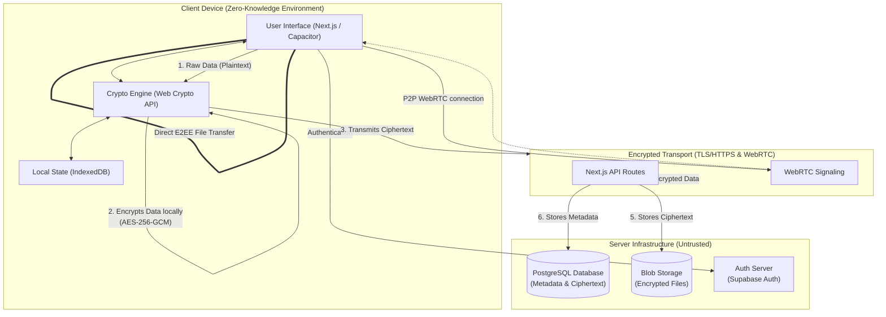

# Title of proposed idea/innovation
Zyphor: A Zero-Knowledge Unified Secure Communication and Productivity Platform

---

# 6. Briefly explain newness/uniqueness of the innovation
Zyphor introduces a paradigm shift in digital privacy by unifying disparate productivity and communication tools—file sharing, personal vault, messaging, password management, and notes—into a single, cohesive ecosystem governed by a strict zero-knowledge security model. Unlike existing solutions that either provide fragmented secure services (e.g., a standalone secure messenger or a separate encrypted drive) or compromise privacy for convenience, Zyphor ensures that all sensitive user data is encrypted client-side using advanced Web Crypto APIs (AES-256-GCM) before leaving the device. The server only routes ciphertext, meaning the platform operator cannot access the data under any circumstances. Zyphor uniquely combines WebRTC for peer-to-peer secure file transfers without server storage and a comprehensive encryption layer that scales across text, media, passwords, and voice/video calls. Its modular architecture allows seamless cross-device synchronization while maintaining cryptographic integrity. By integrating features like burn-after-read, automated key generation, and seamless auth without breaking end-to-end encryption, Zyphor provides enterprise-grade privacy to everyday consumers and businesses in one accessible interface.

---

# 7. Concept & Objective
**Concept:** 
Zyphor is designed as an all-in-one privacy-first platform that eliminates the need to trust service providers with sensitive data. It operates on a unified architecture where end-to-end encryption (E2EE) is the default across all modules: Zyphor Files (P2P and server-backed E2EE transfers), Zyphor Vault (encrypted personal storage), Secure Chat (1:1 and group messaging), Secure Notes, and a Password Manager. 

**Objective:**
1. Absolute Data Sovereignty: To provide users with complete ownership of their digital footprint through zero-knowledge architecture, ensuring no third party can decrypt their content.
2. Unified Experience: To eliminate the friction of using multiple disparate applications for secure workflows by centralizing communication, file management, and credential storage.
3. Seamless Security: To make military-grade encryption invisible and effortless for non-technical users.
4. Scalable Collaboration: To offer organizations and individuals a platform that supports secure real-time collaboration alongside encrypted static storage without compromising compliance or data integrity.

---

# 8. Specify the potential areas of application in industry/market in brief
1. Healthcare & Telemedicine: Enables HIPAA-compliant secure transfer of medical records, test results, and remote patient consultations through E2EE messaging and video calls, ensuring patient data confidentiality.
2. Legal & Financial Services: Provides a secure vault and sharing mechanism for highly sensitive contracts, intellectual property, and financial statements. The burn-after-download and audit logging features ensure strict access control and compliance.
3. Enterprise & Corporate: Organizations can utilize the Enterprise module for secure team workspaces, E2EE channels, and shared vaults. It prevents corporate espionage and data breaches by ensuring internal communications and proprietary assets are inaccessible to external cloud providers.
4. Journalism & Whistleblowing: Offers a safe haven for journalists to communicate with sources and store sensitive evidence without the risk of interception or server-side data extraction.
5. Consumer Privacy: Everyday users seeking alternatives to Big Tech can use Zyphor as a secure personal cloud for storing private photos, managing passwords, and communicating safely.

---

# 9. Briefly provide the market potential of idea/innovation
The global market for secure communication and encrypted storage is experiencing explosive growth, driven by rising cybercrime, increasing regulatory pressures (GDPR, CCPA), and growing consumer awareness of data privacy. The secure messaging market alone is projected to reach multi-billion-dollar valuations, while the cloud storage security market is expanding at a double-digit CAGR. Zyphor sits at the lucrative intersection of the Cybersecurity, Cloud Storage, and Unified Communications as a Service (UCaaS) markets. 

Currently, users suffer from "app fatigue," forced to pay for separate subscriptions for secure cloud storage, messaging, and password management. Zyphor’s market potential lies in its unique value proposition of consolidating these services into a single, cost-effective, zero-knowledge ecosystem. This unified approach appeals strongly to Small and Medium Businesses (SMBs) looking to simplify their IT stack and reduce software costs, as well as privacy-conscious consumers. By offering tiered enterprise plans with SSO, compliance logs, and team workspaces, Zyphor can capture significant recurring revenue in the B2B sector, presenting a high-growth, scalable business opportunity in the booming digital privacy economy.

---

# 10. Upload Block diagram/ flow chart/ Circuit Diagram/Pictures
*(Note: A Mermaid-js diagram is provided below which can be rendered to an image file or viewed in Markdown viewers. You can also take a screenshot of this diagram to upload it.)*

